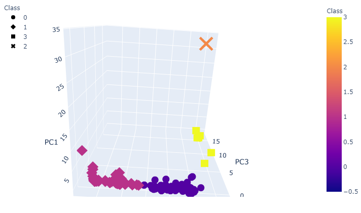
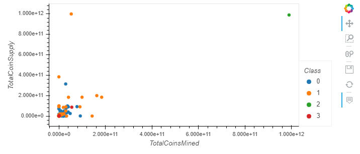

# 18-Cryptocurrencies
Module 18: Unsupervised Machine Learning and Cryptocurrencies

## Overview
We've been tasked with using unsupervised learning to analyze data on the cryptocurrencies traded on the market.

## Resources
- Python 3.7, Scipy 0.17+, Scikit-learn 0.21+, hvplot
- crypto_data.csv

## Summary

### 1- Data Preprocessing
- We load the csv file into a dataFrame.

- we set the index to the first column
          
          crypto_df = crypto_df.set_index("Unnamed: 0")
          crypto_df.index.name = None
- we remove all cryptocurrencies that aren't trading
          
          crypto_df = crypto_df[crypto_df["IsTrading"]==True]
- we remove all cryptocurrencies that don’t have an algorithm defined
         
           crypto_df = crypto_df.dropna(subset=['Algorithm'])
- we remove the IsTrading column
           
           crypto_df = crypto_df.drop(columns=["IsTrading"])
- we remove all cryptocurrencies with at least one null value
            
            crypto_df = crypto_df.dropna()
- we remove all cryptocurrencies without coins mined
            
            crypto_df = crypto_df[crypto_df["TotalCoinsMined"]>0]
- we store the column of names of cryptocurrencies in a different DataFrame (with same index) and remove the column
            
            coins_name = crypto_df["CoinName"]
             crypto_df = crypto_df.drop(columns=["CoinName"])

- we check the types of columns, then change the type of "TotalCoinSupply" to numerical
    
            crypto_df.dtypes
                    Algorithm           object
                    ProofType           object
                    TotalCoinsMined    float64
                    TotalCoinSupply    float64
                    dtype: object
            crypto_df['TotalCoinSupply'] = pd.to_numeric(crypto_df['TotalCoinSupply'])
- we use the method get_dummies on the 2 "object" columns so there are only numerical columns
            
            X = pd.get_dummies(crypto_df, columns = (["Algorithm", "ProofType"]))
     
  
- we standardize all of the Data using StandardScaler from sklearn, so we can use PCA and K-means algorithms

            X_scaled = StandardScaler().fit_transform(X)

  

### 2- Reducing Data Dimensions Using PCA
We use the PCA algorithm from sklearn to reduce the dimensions of the X DataFrame down to three principal components.

            pca = PCA(n_components=3, random_state=0)
            X_pca = pca.fit_transform(X_scaled)
            pcs_df = pd.DataFrame(data=X_pca, columns=["PC1", "PC2", "PC3"], index = crypto_df.index)

 

### 3- Clustering Cryptocurrencies Using K-means
- we create the elbow curve to find the best value for K
            
            inertia = []
            k = list(range(1, 11))
            for i in k:
                  kmeans = KMeans(n_clusters=i, random_state=0)
                  kmeans.fit(pcs_df)
                  inertia.append(kmeans.inertia_)
            elbow_data = {"k" :k, "inertia" : inertia}
            df_elbow = pd.DataFrame(elbow_data)
            df_elbow.hvplot.line(x="k", y="inertia", xticks=k, title="Elbow Curve")   
     
  
  The curve shows that the best value for K is 4.
  
- we run the K-mean algorithm with K=4 to get, and get an array of predictions/classes for all the cryptocurrencies, now divided into 4 classes.

- we create a new DataFrame that includes all the given info and the newly created classes.

### 4- Visualizing Results
- we create 3D scatter plots to show the 4 different classes. These can be vizualized when using the Principal Components as axes, but also the initial features (ProofType, TotalCoinsMined, TotalCoinSupply) as axes. These 4 classes can then be categorized easily.

 

- thanks to hvplot.table we can show a table of all the 531 current tradable cryptocurrencies

- for the different clusters, we can show the contrast between the number of available coins versus the total number of mined coins
(second graph without the outliers)

 

            

